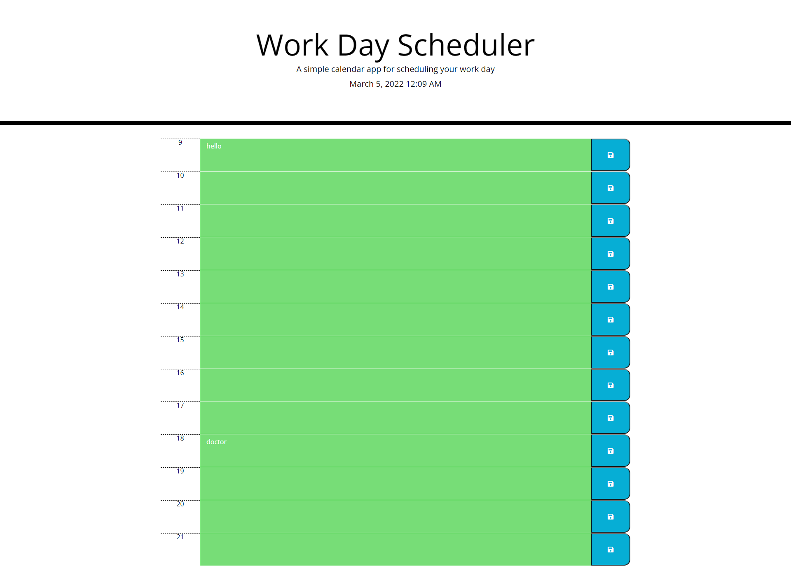

# fun-schedule

## Project Description
In this project we were tasked with creating a day planner application. The first thing the project was supposed to do was to display the date at the top of the page. This is accomplished using moment and formating the date to display what is asked. The next task is to layout the hours of a the day. I laid out a 12 hour day from 9 to 21:00 to give a full day of activites to list. The next task was color coding all the blocks so that they showed the present, future, and past. This was done through the use of a forEach loop to create a scenario where if the id value for each text element is greater than or less than the current hour a class of future of past will be
assigned otherwise they will be considered the present. The last thing to do was make the save button functional so that when text is typed into the many save boxes on the page and the save button is pressed the text will be saved to local storage and saved after the page refreshes. This was done through another forEach loop to loop through each of the save buttons and create an event listener for each one storing the current content in the text box to local storage and calling it back to that same spot upon page refresh.  

## Project Link
The project site can be found [here](https://choyle-01.github.io/fun-schedule//)

## Github Repository
The Github repository can be found [here](https://github.com/choyle-01/fun-schedule)

## Visuals
